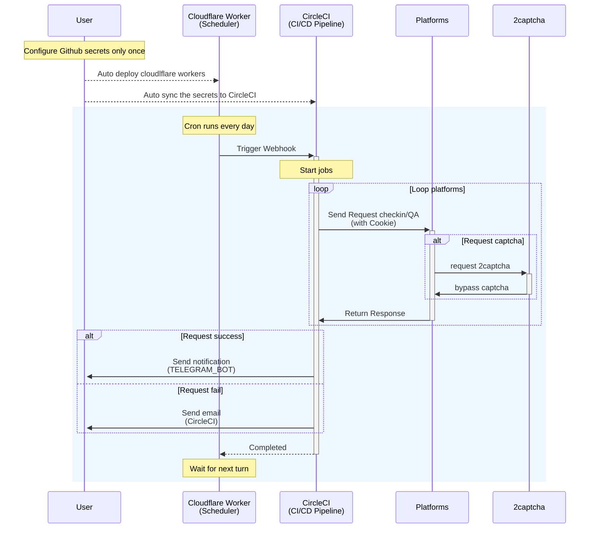

# CloudCheckin

<div align="center">
  <picture>
    
  </picture>

基于 CI/CD 以及 Cloudflare Workers 实现多平台自动签到以及答题。

[English Version](./README-en.md) |
中文版本
</div>

## 功能
> 欢迎 :star:，添加更多平台欢迎 issue 或者 PR。

每天自动完成平台任务，完成以后会通过 telegram 机器人通知，如果失败则会直接通过 CircleCI 发送邮件通知。

- **Nodeseek**
  - 自动签到
- **V2EX**
  - 自动签到
- **一亩三分地**
  - 自动签到
  - 自动答题

## 架构及时序图

<div align="center">

</div>



## 快速开始

Fork 本仓库到你自己的仓库，然后添加对应的配置项到仓库的 secrets 中（在 `settings -> secrets and variables -> actions -> new repository secret`）。

### 注册 [CircleCI](https://circleci.com/)

[CircleCI](https://circleci.com/) 是一个优秀的 CI/CD 平台，Free plan 的 `30,000 credits/mo, that’s up to 6,000 build mins` 完全可以支撑起本项目的所有需求。

详细的注册教程请见 [CloudCheckin Wiki](https://github.com/timerring/CloudCheckin/wiki/CircleCI-Registeration)。

> [!IMPORTANT]
> **注意 trigger 的 `CIRCLECI_WEBHOOK_URL` 拼接完成后填写在 Github Actions 的 secrets 中**。

### 申请 CircleCI Token

在 [CircleCI](https://app.circleci.com/settings/user/tokens) 页面申请 Token 即可，并且添加到仓库的 secrets 中，命名为 `CIRCLECI_TOKEN`。

### 复制 Orgid

请在你创建的 Organization Settings 里找到 Organization ID，并且添加到仓库的 secrets 中，命名为 `CIRCLECI_ORG_ID`。


### 配置 Cloudflare Worker

1. 登录 [Cloudflare](https://dash.cloudflare.com/login) 账号，[在 `Profile` 页面](https://dash.cloudflare.com/profile/api-tokens) 创建 `Create Token`(建议 `Edit Cloudflare Workers` 模板保持默认就好)。
2. 将该 Token 添加到仓库的 secrets 中，命名为 `CLOUDFLARE_API_TOKEN`。

### 设置任务定时

可以自行修改 `wrangler.toml` 设置任务定时 cron 字段，注意执行时间固定为 UTC 时区，北京时间为 UTC+8 时区，请自行转换时差。

https://github.com/timerring/CloudCheckin/blob/0b719258ab4f5f746b067798eb2a4185a71631f7/wrangler.toml#L6

### 配置平台

> 如果不需要某个平台，可以直接编辑删除 `.circleci/config.yml` 目录下该平台对应的项即可，例如无需一亩三分地，可以考虑删除 57-58 行。

#### 配置 Telegram 通知

1. 按照 [telegram bot](https://core.telegram.org/bots/features#botfather) 的说明创建一个 telegram 机器人并获取 `token`
2. 将机器人添加为您的联系人并发送一条消息。然后访问 https://api.telegram.org/bot{TELEGRAM_TOKEN}/getUpdates 获取 `chat id`（将 `{TELEGRAM_TOKEN}` 替换为步骤1中获得的 token）
3. 将 `token` 和 `chat id` 添加到仓库密钥中，分别命名为 `TELEGRAM_TOKEN` 和 `TELEGRAM_CHAT_ID`

#### 配置签到平台

<details>
<summary>配置 Nodeseek 签到</summary>

1. 从 Nodeseek 网站获取 `cookie`（获取方法请参考 [COOKIE 获取教程](https://blog.timerring.com/posts/the-way-to-get-cookie/)）
2. 将 `cookie` 添加到仓库密钥中，命名为 `NODESEEK_COOKIE`
</details>


<details>
<summary>配置 V2EX 签到</summary>

1. 从 V2EX 网站获取 `cookie`（获取方法请参考 [COOKIE 获取教程](https://blog.timerring.com/posts/the-way-to-get-cookie/)）
2. 注意，由于 V2EX 的 cookie 包含 `"` 以及 `$` 特殊字符，可能会导致 sh 中传递 secrets 失败，因此需要转义这两个特殊字符，简单替换脚本为 `echo '你的V2EX cookie' | sed 's/["$]/\\&/g'`。
3. 将转义后的 `cookie` 添加到仓库密钥中，命名为 `V2EX_COOKIE`
</details>

<details>
<summary>配置 一亩三分地 签到及答题</summary>

1. 从 一亩三分地 网站获取 `cookie`（获取方法请参考 [COOKIE 获取教程](https://blog.timerring.com/posts/the-way-to-get-cookie/)）
2. 将 `cookie` 添加到仓库密钥中，命名为 `ONEPOINT3ACRES_COOKIE`
3. 从 [2captcha](https://2captcha.com/) 充值获取 `api key`，(由于一亩三分地的签到以及答题需要通过 Cloudflare Turnstile 的验证，因此这里通过 2captcha 的 api 来解决验证问题)
   - 注意： 2captcha 的 api 需要付费，3 美元起充，支持支付宝。每次成功通过验证约 0.00145 美元，3 美元能用 2068 次，约 2.83 年。
4. 将 `api key` 添加到仓库密钥中，命名为 `TWOCAPTCHA_APIKEY`
</details>

#### 同步配置

配置完成所有内容后，请手动执行一次 `Setup CircleCI Context and Secrets` 以及 `Deploy Cloudflare Worker` workflow 确保配置 secrets 通过 CircleCI CLI 正确同步至 CircleCI contexts secrets，并将 Cloudflare Worker 正确部署。（Actions -> `Setup CircleCI Context and Secrets` -> `Run workflow` 以及 Actions -> `Deploy Cloudflare Worker` -> `Run workflow`）

> [!IMPORTANT]
> 有时 cookie 会过期导致签到失败，如果遇到失败情况，请考虑重新获取 cookie 填入 Secrets，再手动执行 `Setup CircleCI Context and Secrets` workflow 同步 cookie 到 CircleCI。

## 本地调试

```bash
# 安装依赖
pip install -r requirements.txt

# 复制环境变量模板并填入你的配置
cp .env.test .env

# 运行签到脚本
python -m nodeseek.nodeseek
python -m v2ex.v2ex
python -m onepoint3acres.onepoint3acres
```

## 常见问题

1. 为什么要采用 CircleCI，不直接用 Github Actions？
   
   直接用 Github Actions 容易导致潜在的仓库被封风险，尽管本项目一天只触发一次请求不像 upptime 等开源项目有超高的并发请求量，但是本着本分的原则，还是不要给 Github 添加过多负担。CircleCI 同样是优秀的 CI/CD 平台，Free plan 的 30,000 credits/mo, that’s up to 6,000 build mins 完全可以支撑起本项目的所有需求，另外 CircleCI 的不同 Project 间的 contexts 设计思想相较于一般的 CI/CD 有很大程度上的创新，更多用户使用并且熟悉 CircleCI，对于用户以及平台来说都是双方受益的。

2. 为什么不采用 Cloudflare Worker 等 Serverless 函数计算？
   
   已经尝试过 Cloudflare Worker，本地 wrangler dev 有效，但是 deploy Cloudflare Worker 之后，由于 Cloudflare edge 请求会带有明显的 cf 标志，很多平台已经限制了 Cloudflare Worker 的请求。至于更多的函数计算平台还在尝试中，有进展会同步在 Repo 里。当然，如果你对 Cloudflare Worker 的方式有兴趣，欢迎继续尝试的工作，我本地调试的 demo 已经放置于 `cloudflareworkers` 目录下。

3. 为什么要切换到 Cloudflare Worker 作为 Webhook 触发器，不用 CircleCI 的 Scheduled？
   根据 [CircleCI 的最新条款](https://circleci.com/docs/version-control-system-integration-overview/#pipeline-triggers-and-integrations)，Scheduled pipelines 将不对 `GitHub App` 下的个人仓库开放，因此需要切换到 [Custom Webhook](https://circleci.com/docs/custom-webhooks/) 的形式，通过 Cloudflare Worker 作为定时触发器，当然你也可以采用[其他方式调用 Webhook](https://circleci.com/docs/triggers-overview/#trigger-a-pipeline-from-a-custom-webhook)，只需要定时调用 Webhook 的接口即可，这里我采用了 Cloudflare Worker 作为定时触发器。

## 贡献

欢迎提交你需要的平台，语言不限制。

> 如果你是 Python 用户，建议使用 `curl_cffi` 库而不是 `requests` 等库，`curl_cffi` 能够更精确地模拟浏览器发送请求，极大程度上防止网站风控。

## 参考
- [curl_cffi](https://github.com/lexiforest/curl_cffi)
- [2captcha](https://github.com/2captcha/2captcha-python)
- [1point3acres](https://github.com/harryhare/1point3acres)
- [V2EX](https://github.com/CruiseTian/action-hub)
- [nodeseek](https://github.com/xinycai/nodeseek_signin)
